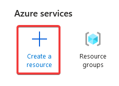
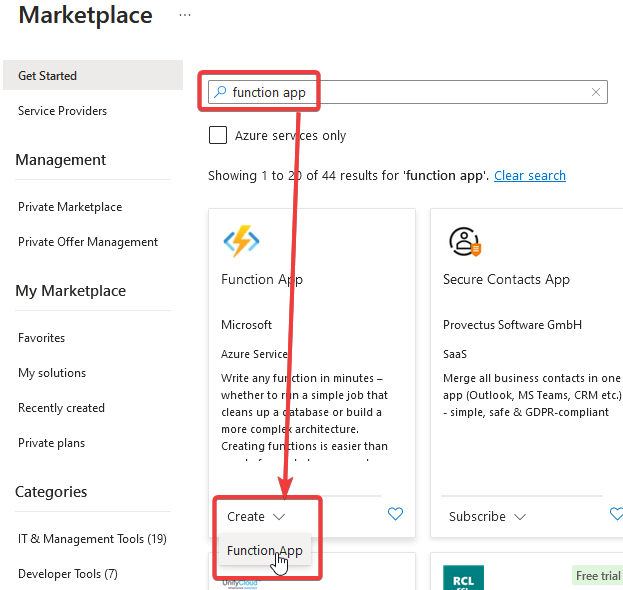
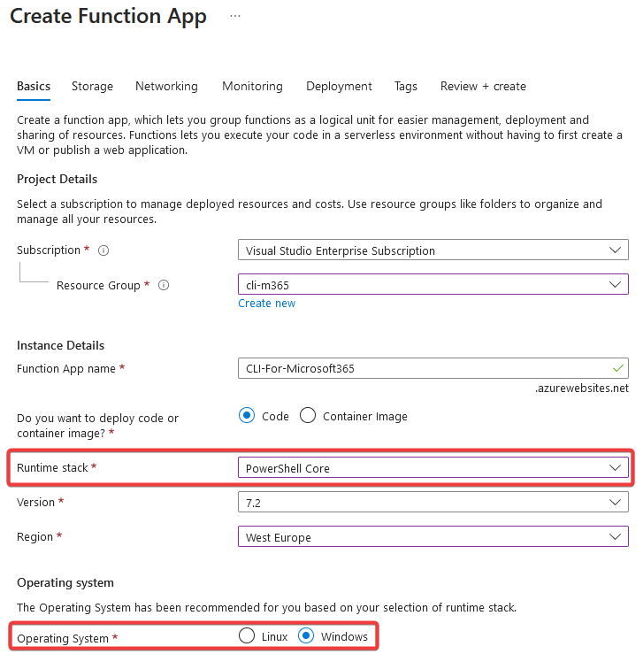
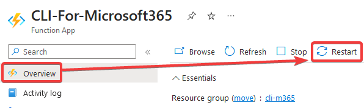

# Run CLI on PowerShell Azure Function 

Getting CLI for Microsoft 365 to work with Azure Functions can make managing Microsoft 365 easier and automate many tasks.
In this guide, you will learn how to setup CLI for Microsoft 365 on an Azure Function using managed identity.

## Prerequisites

In order to follow this guide smoothly, we assume that certain things are already present in your environment.
The tools listed below are used in this guide. While they are not mandatory to use, they recommended when you are following this guide.

- [Visual Studio code](https://code.visualstudio.com)
  - [Azure Resources extension](https://marketplace.visualstudio.com/items?itemName=ms-azuretools.vscode-azureresourcegroups)
  - [Azure Functions extension](https://marketplace.visualstudio.com/items?itemName=ms-azuretools.vscode-azurefunctions)

## Setting up Azure Function

The first thing we have to do is to create an Azure Function. We start by creating a Function App in Azure. Our goal for this part is to get Node.js running on the Azure Function.

1. Click on the **create a resource** button in the Azure portal.

2. Create a new Function App in Azure.

3. Fill out the required fields of the form and click on the **review + create** button.
While CLI for Microsoft 365 works on multiple platforms, this guide only explains the setup on a PowerShell Azure Function running on Windows.
Note that the version of PowerShell you are targeting doesn't really matter.

4. Open the Azure Function app.

5. Navigate to **environment veriables**. Over there, add a new environment variable with name `WEBSITE_NODE_DEFAULT_VERSION` and value `~20` to set the right Node version.

:::note

At the time of writing, the LTS version of Node.js is v20.
We recommend to run CLI for Microsoft 365 on the LTS version of Node.js.
Visit the [website of Node.js](https://nodejs.org) to discover the current LTS version of Node.js and update the `WEBSITE_NODE_DEFAULT_VERSION` environment variable accordingly.

:::

6. Reboot your Azure Function in order to use the new Node version.

This is it, you have now created an Azure Function App with the right Node version.
